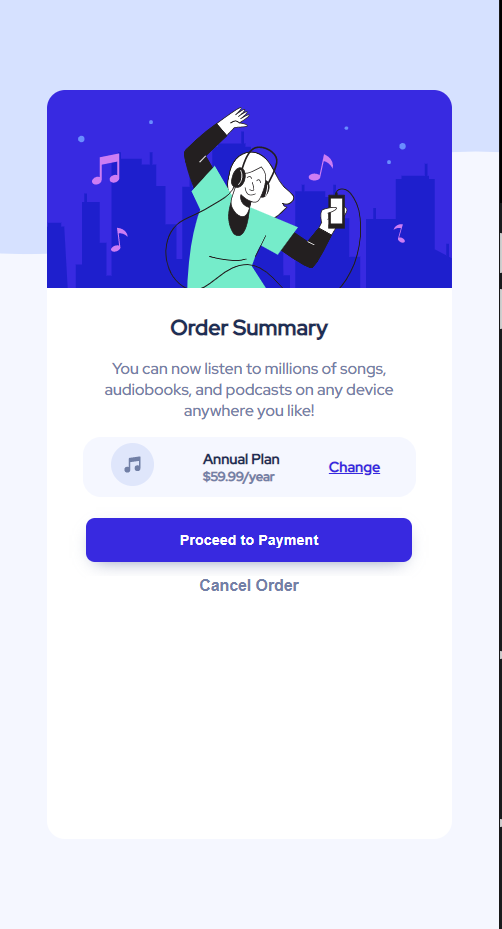

# Frontend Mentor - Order summary card solution

This is a solution to the [Order summary card challenge on Frontend Mentor](https://www.frontendmentor.io/challenges/order-summary-component-QlPmajDUj). Frontend Mentor challenges help you improve your coding skills by building realistic projects. 

## Table of contents

- [Overview](#overview)
  - [The challenge](#the-challenge)
  - [Screenshot](#screenshot)
  - [Links](#links)
- [My process](#my-process)
  - [Built with](#built-with)
  - [What I learned](#what-i-learned)
  - [Continued development](#continued-development)
- [Author](#author)

### The challenge

Users should be able to:

- See hover states for interactive elements

### Screenshot

Mobile

Desktop

### Links

- Solution URL: [Add solution URL here](https://angelostd.github.io/order-summary/)
- Live Site URL: [Add live site URL here](https://angelostd.github.io/order-summary/)

## My process

  Mobile design first, desktop parameters, and finally hover pseudo classes :D.

### Built with

- Semantic HTML5 markup
- CSS custom properties
- Flexbox
- CSS Grid
- Mobile-first workflow

### What I learned

Still learning Media Queries

### Continued development

 'Transform'

## Author

- Frontend Mentor - [@angelostd](https://www.frontendmentor.io/profile/angelostd)
